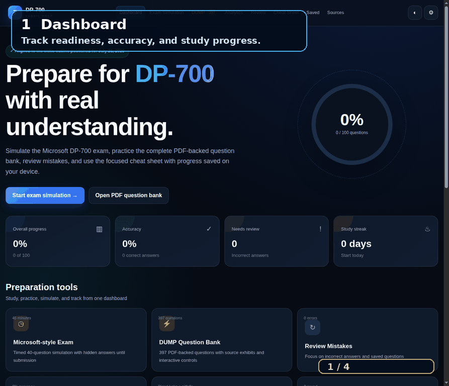

# DP-700 Fabric Exam Simulator

[](https://fatoomnoour.github.io/dp700-study/)
[](https://fatoomnoour.github.io/dp700-study/)
[](https://github.com/Fatoomnoour/dp700-study)
[](https://learn.microsoft.com/en-us/credentials/certifications/resources/study-guides/dp-700)

A focused, browser-based Microsoft Fabric DP-700 exam simulator built with HTML, CSS, Vanilla JavaScript, `localStorage`, and a PWA service worker. The redesigned experience prioritizes the core exam simulation, source-backed DUMP practice, mistakes review, analytics, and a high-yield cheat sheet. It runs directly on GitHub Pages with no backend, npm installation, or learner tracking.

## Demo



The short [MP4 interface walkthrough](assets/media/dp700-demo.mp4) shows the dashboard, timed exam simulation, 279-question DUMP bank, source exhibits, and high-yield cheat sheet. A still storyboard is available at [`assets/media/dp700-demo-storyboard.jpg`](assets/media/dp700-demo-storyboard.jpg).

## Exam-focused experience

The visible navigation now focuses on the Microsoft-style timed exam, the complete DUMP bank, analytics, review, bookmarks, official sources, and the professional cheat sheet. Learn, Course, Practice, Quick, the legacy simulator, and Flashcards are no longer exposed as primary navigation items.

## Current question and exhibit coverage

The application exposes **279 interactive DUMP items** in the requested file order: DP-700N1 (118), DP-700N2 (43), then DP-700N3 (118). Every imported record has a source-page exhibit, and the library includes an explicit source-file filter. Supported controls include single choice, multiple choice, Yes/No, dropdown hotspot, and drag-and-drop with an accessible select fallback.

The cheat sheet now concentrates on repeated DP-700 traps: Direct Lake guardrails and fallback, V-Order, OPTIMIZE versus VACUUM, RLS versus masking, Git versus deployment pipelines, event time versus processing time, Spark concurrency, medallion layers, and tool selection.

## v9 professional-learning system

The deeper lesson and professional-path assets remain in the repository for reference, but they are not part of the primary exam navigation.

- 15 existing course modules and all 213 existing lesson activities remain in their original order.
- Every activity continues to open as a complete bilingual lesson.
- Foundation diagnostic with 18 questions and skill-area results.
- Seven-block prerequisite bootcamp covering SQL, Python, Spark, KQL, data engineering, Fabric, and Git.
- Four learning-depth modes inside every lesson:
  - Foundation
  - Exam Level
  - Professional Level
  - Deep Dive
- Topic Mastery Gate inside every lesson.
- Module Mastery Dashboard with five evidence levels:
  - Not Started
  - Studied
  - Practiced
  - Exam Ready
  - Professionally Mastered
- 15 independent module Challenge Labs.
- 8 broken-solution Troubleshooting Labs.
- 12-scenario Fabric Decision Simulator.
- 15 module assessments containing 75 new original scenario questions.
- Three complete portfolio projects:
  - Batch Data Engineering Platform
  - Enterprise Fabric Warehouse
  - Real-Time Intelligence Platform
- Separate `localStorage` namespace: `dp700-professional-path-v9`.
- v9 progress is included in progress export/import.

## Repository quality and portfolio presentation

The repository includes a live-demo badge, Microsoft Learn alignment, source attribution, accessible answer controls, explicit unscored handling, reproducible static hosting, and small feature-focused commits. Recommended GitHub profile improvements are to pin this repository, add the `microsoft-fabric`, `dp-700`, `data-engineering`, `spark`, and `lakehouse` topics, keep the live demo and screenshot current, and use concise commit messages. GitHub achievement badges are earned by the account through legitimate GitHub activity; they cannot be safely or honestly fabricated by the repository itself.

## Protected existing content

This update does not replace or edit:

- `data/questions.js` — original Practice bank.
- `data/dump.js` — validated 118-question DUMP bank.
- `data/dump-interactions.js` — DUMP interaction definitions.
- `assets/dump/` — DUMP exhibits.
- `important/DP700_Practice_Exam.html` — independent 93-question IMPORTANT simulator.

Existing IDs, answers, ordering, scoring behavior, and saved progress remain unchanged.

## Files added or changed by v9

```text
index.html
manifest.webmanifest
sw.js
README.md
assets/css/styles.css
assets/js/app.js
data/course.js
data/course-content.js
data/arabic-lessons.js
data/professional-path.js       # new v9 learning data
UPDATE-V9.txt
VALIDATION-V9.txt
PUBLISH-V9-COMMANDS.txt
publish-v9.cmd
```

## Apply the patch

Extract the contents of the v9 ZIP directly over the existing repository root and allow Windows to replace matching files.

Then run:

```cmd
publish-v9.cmd
```

Or run manually:

```cmd
git status
git add index.html manifest.webmanifest sw.js README.md assets/css/styles.css assets/js/app.js data/course.js data/course-content.js data/arabic-lessons.js data/professional-path.js UPDATE-V9.txt VALIDATION-V9.txt PUBLISH-V9-COMMANDS.txt publish-v9.cmd
git commit -m "Add DP-700 professional mastery path, challenges and projects (v9)"
git push origin main
```

After GitHub Pages finishes deploying, open:

```text
https://fatoomnoour.github.io/dp700/?v=9#professional
```

Use `Ctrl + F5` if the browser still displays the v8 cached version.

## Run locally

```cmd
cd C:\path\to\dp700-interactive
py -m http.server 8080
```

Then open:

```text
http://localhost:8080/?v=9#professional
```

## Privacy

All progress remains in the learner's browser. The application has no login, backend, or analytics tracker.

## Uploaded question coverage

The standalone site is based on the uploaded DP-700N1, DP-700N2, and DP-700N3 question sources. The imported bank and complete interactive DUMP experience contain exactly 279 PDF records: N1 (118), N2 (43), and N3 (118), in that order. Source-dependent items are rendered with an exhibit image and interactive controls rather than static answer text whenever possible.

Supported simulations include single choice, multiple choice, Yes/No tables, dropdown hotspots, drag-and-drop hotspots with an accessible select fallback, source exhibits, answer checking, corrected-answer feedback, explanations, bookmarks, progress tracking, and review queues. Image-dependent questions use the exhibit assets under `assets/dump/`; questions whose source image or answer choices are incomplete are marked as unscored instead of silently assigning an unsupported answer.

The source of truth for current product behavior remains the linked Microsoft Learn references shown in the application. The uploaded PDFs are study material and are not official Microsoft exam content.
